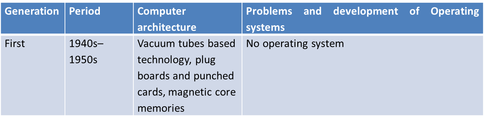
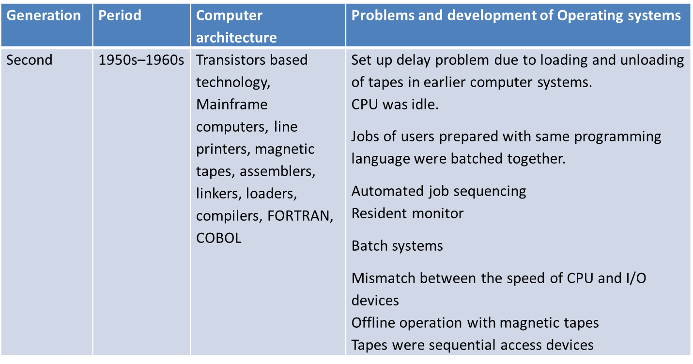
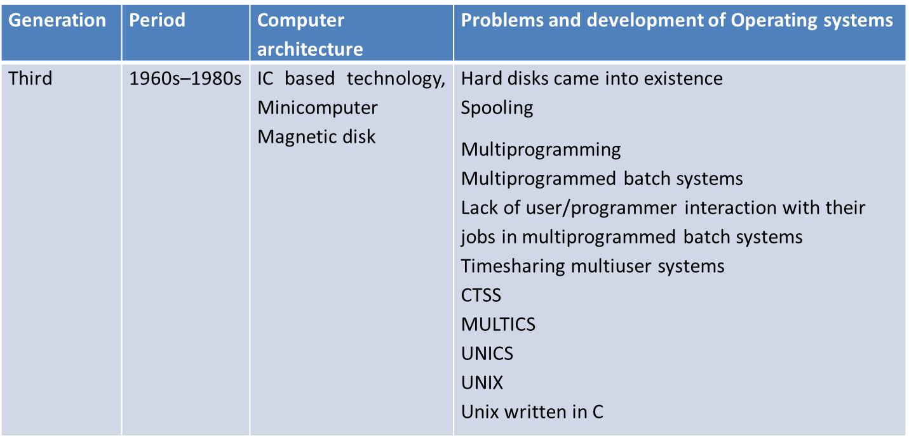
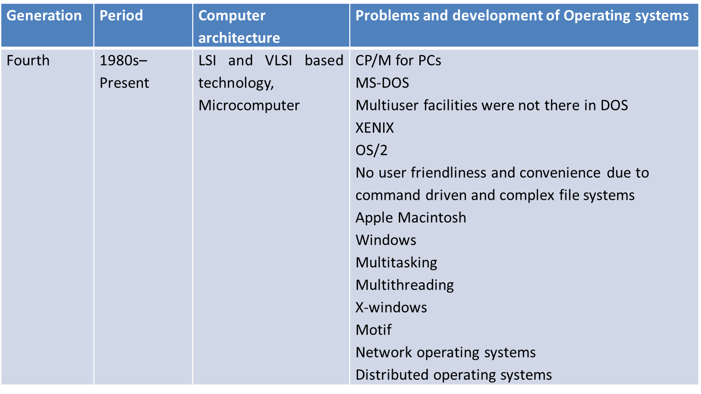

# 2. Generations of Operating Systems

| **Generation** | **Period**          | **Characteristics**                                                 |
| -------------- | ------------------- | ------------------------------------------------------------------- |
| **1st Gen**    | 1940s–early 50s     | - Vacuum tubes - No OS, manually operated - Machine language  |
| **2nd Gen**    | Mid 1950s–early 60s | - Batch systems - Assembly language - Punched cards           |
| **3rd Gen**    | Mid 1960s–70s       | - Multiprogramming - Time-sharing - Used high-level languages |
| **4th Gen**    | 1980s–2000s         | - Personal computers - GUI-based OS - Networking introduced   |
| **5th Gen**    | 2000s–present       | - Distributed & mobile OS - Cloud computing - AI integration  |

---

## 🔹 Gen 1

---
## 🔹 Gen 2

---
## 🔹 Gen 3

---
## 🔹 Gen 4

